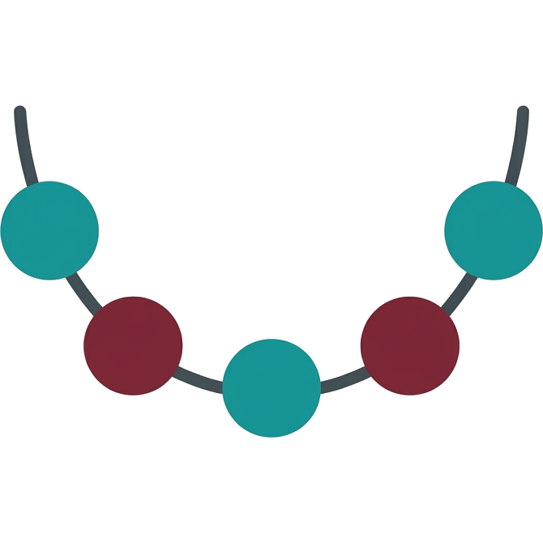

<div align="center">



# strand

**A human-friendly planning layer over [beads](https://github.com/steveyegge/beads) (`bd`).**

*See the forest, not the catalog of trees.*

</div>

---

`bd` is a great issue tracker — for **agents**. It tracks the work robots do, at the
grain robots care about. Yegge's own guidance: for *human* planning, reach for Linear or
Jira. That leaves a solo human staring at a CLI built for machines.

**strand is the missing middle.** A single local binary that renders your beads data so one
human can orient, prioritize, see structure, and decide what to do next — without leaving
the beads store and without standing up a "real" PM tool.

It doesn't duplicate beads. It **synthesizes** it: where the mass sits, what's stuck, what's
drifting — the few things in motion and their shape, in one look.

## The idea

strand reads three tiers and splits the work by who owns each:

```
project north star   ── one line: what this project is FOR
   └ epics            ┐  human territory — the big picture you shape:
       └ stories      ┘  recognizable epics and the stories beneath them
           └ tasks    ──  agent territory: decomposition, deps, order (shown, read-mostly)
```

You shape the **top** — author epics, break them into stories, check that the work below
still ladders up to the north star. Agents own the **bottom** — tasks, dependencies, order.
strand makes the top easy to shape and the bottom easy to read, so each side stays out of
the other's way.

## Quick start

You need [`bd`](https://github.com/steveyegge/beads) on your `PATH` and Go 1.26+.

```sh
go run ./cmd/strand                       # serve http://127.0.0.1:7777 over the cwd's .beads
go run ./cmd/strand -dir /path/to/repo    # point at another beads workspace
go run ./cmd/strand -addr :8080           # bind elsewhere
```

| flag    | default          | meaning                    |
|---------|------------------|----------------------------|
| `-addr` | `127.0.0.1:7777` | listen address             |
| `-dir`  | cwd              | beads workspace directory  |
| `-bd`   | `bd`             | path to the `bd` binary    |

## Views

| Route        | What it gives you                                                         |
|--------------|---------------------------------------------------------------------------|
| `/`          | the synthesis surface — epics and stories at a glance, sized by weight     |
| `/board`     | kanban by status (open / blocked / in-progress / closed)                  |
| `/list`      | the flat catalog — every bead, filterable; the drill-in, not the default   |
| `/insights`  | the graph view: what's foundational, what's a bottleneck, what's stale     |
| `/bead/{id}` | one bead's drawer — Description leads; edit the shape, agent ops demoted    |

## Insights

strand builds the dependency graph in-process (via [gonum](https://gonum.org)) and surfaces
the few numbers that drive a decision, not a wall of metrics:

- **Importance** — PageRank over the dependency graph: foundational beads (many things rest
  on them) rank high.
- **Bottlenecks** — betweenness: beads that many chains route through.
- **Critical path** — the single longest dependency chain to the finish.
- **Cross-flags** — a high-rank bead that's *also* blocked or stale is where to look first.

## How it works

strand shells out to the `bd` CLI and serves a small server-rendered web app. It never
touches the Dolt store directly and keeps no schema in sync — `bd` stays the single source
of truth and the single write path. Everything is one self-contained binary with assets
embedded.

```
cmd/strand/       entrypoint, flags, http server
internal/bd/      thin wrapper over the bd CLI (shell out, parse JSON)
internal/strand/  the domain model — beads, tiers, ordering
internal/graph/   dependency-graph metrics (PageRank, betweenness, critical path)
internal/insight/ rolls the graph + bead state up into the Insights dashboard
internal/server/  routes, handlers, html/template rendering
web/              embedded front-end (templates, static assets)
```

## Build

```sh
make build       # -> ./bin/strand, self-contained, assets embedded
make check       # vet + lint + race tests
make install     # build and install locally
```

## License

MIT — see [LICENSE](LICENSE).
